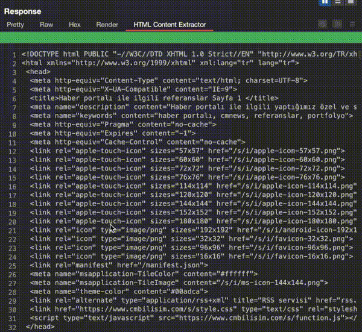

# Overview

This is a Burp Suite Extension that applies CSS selectors to extract and analyze specific parts of HTML content directly from the HTTP message viewer. With the power of CSS selectors, users can target elements, attributes, and nested structures in the HTML document, enabling precise and efficient content analysis during security assessments.

This extension is particularly useful for identifying and extracting HTML elements relevant to vulnerabilities such as XSS, CSP misconfigurations, hidden input fields, or metadata that may expose sensitive information. It helps security professionals save time by enabling precise content extraction directly within Burp Suite.  

# How to Use
1. Intercept HTTP traffic as usual in Burp Suite.
1. Open the extension tab and apply CSS selectors to filter the HTML content from the HTTP message viewer.
1. Use the extracted data for further manual or automated analysis.

For a quick demonstration of how this extension works, check out the short usage video below:




Inspired by [Burp-JQ](https://github.com/synacktiv/burp-jq).

## Build

```bash
$ gradle fatJar
```

## Credits

Burp HTML Parser relies on `jsoup`.

- [jsoup](https://jsoup.org/)

